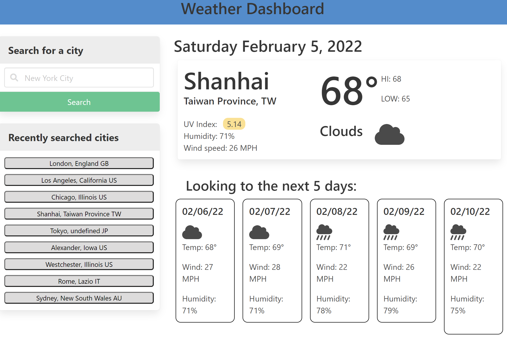

# A Simple Weather Dashboard
Find weather from any location around the world with a simple, but effective, search function. Utilizing OpenWeather API connects the user to search for a city, state, or country to display weather.
  
The dashboard comes with a clean and minimalistic design that allows the weather to be front and center: no overly-complicated interfaces or cluttered UI.
  
This was made as a lightweight alternative to view weather, with the ability to save recent searches right on your machine without the need of signing up for an account.
 

## 📝 Features
 - View the current and future temperatures, wind speeds, humidity and weather conditions from any city across the world
 - Use any combination of search results, or abbreviations, to find the city (ex. nyc works for New York City, so does nyc, ny)
 - Responsive design for all screen sizes
 - UV index changes color for visual effects depending on value
 - Visual weather conditions from Font Awesome to show what the weather is like at a glance
 - Ability to save most 10 recent searches on local machine for easy search any time

## 🚧 List of TO-DO's for future release/collaboration
This, in its current state is a MVP. A list of potential features is listed below.
 - Modify the recent cities list on column to add the newest search on top after searching for the city
 - Add current weather conditions to the recently searched cities, so you can see the conditions in many cities at a glance (though this does add to how many searches per minute that can be submitted to the API. Capped at 60/min for free account)

## 🔑 How to access
The code base can be cloned from the GitHub repo [here](https://github.com/mpityo/Weather-Dashboard).
 
The website may be viewed on GitPages [here](https://mpityo.github.io/Weather-Dashboard/)
 

## 🏆 Credit
Full HTML, CSS, and Javascript functionality by yours truly, @mpityo
 
UCF Boot Camp provided project guidelines and a general mockup of an example site: ([Git Hub](https://github.com/UCF-Coding-Boot-Camp/UCF-VIRT-BO-FSF-PT-12-2021-U-B))
 
 
Project is fully open source: explore the code and upgrade away!
 
 

